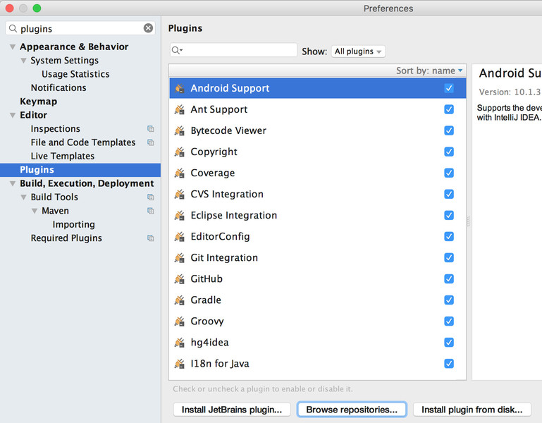
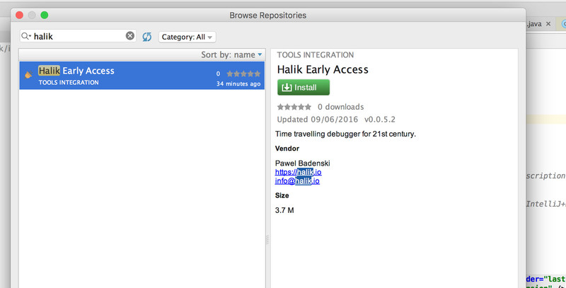
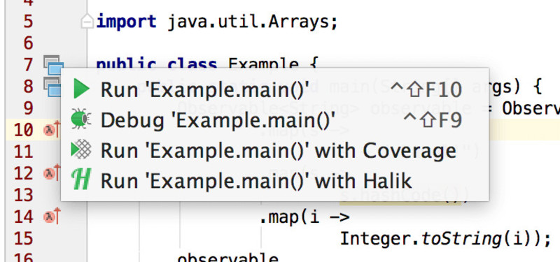
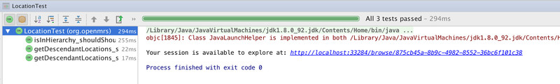

Getting started
=================================

Installation
~~~~~~~~~~~~~~~~~~~~~~~~~~~~~~~~~

1. Go to "Preferences", find "Plugins" panel, and click on "Browse repositories".

2. Type "Halik", and click "Install" when it shows up in the view.

.. _quick-start:

Quick start
~~~~~~~~~~~~~~~~~~~~~~~~~~~~~~~~~

Run your application by clicking Halik icon.

.. note::
  All recorded sessions are stored in "*~/.halik/sessions*" directory. You
  can easily browse them at http://localhost:33284.

After the program finished running you will see a URL to Halik exploration
session. Click on it to open the explorer UI in your browser.

By default, Halik will record all project packages that may contain source code.
This means it will exclude all packaged libraries from recording.

If you need more control over the recording process you will be able 
to :ref:`customize it <manually-configure-recording>`.

