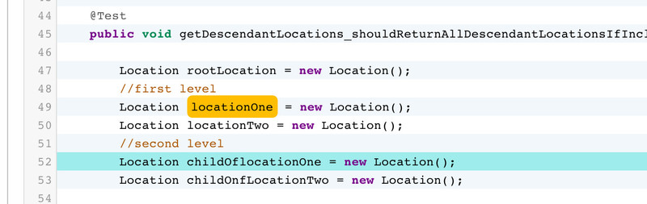
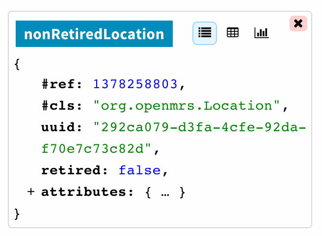
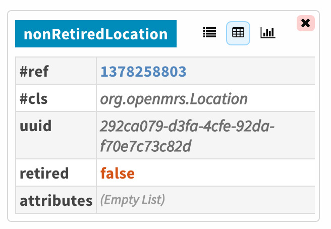
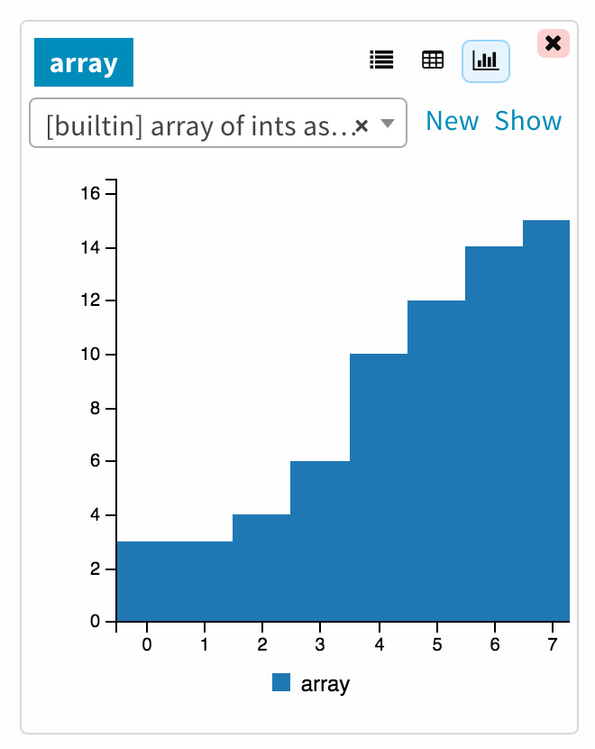
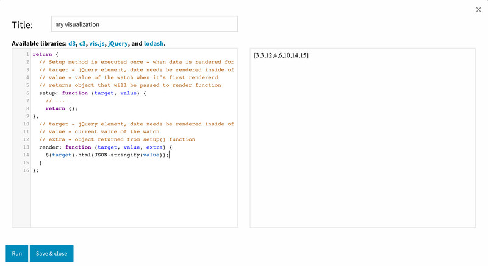

Inspecting state
=================================

Watches
~~~~~~~~~~~~~~~~~~~~~~~~~~~~~~~~~

.. index::
   single: watches; registering

All variables, fields and parameters which value was recorded by Halik
can be "watched". It means that you can observe their state changes as you
browse the session. UI will always indicate whether something can be watched.

Hover over a variable, field, or parameter and it will display an orange background 
block if watching is possible. You can register a watch by clicking on the block.

   Register watch

After you register a watch you will see variable's current value in the "Watches" section.
You can use different display modes to get better understanding of your data.
There are currently two builtin generic display modes.

First one uses a treeview. You can expand and collapse information
based on your interest.

   Tree view

Second one uses a table and it displays all information at once.

   Table view

Visualizations
~~~~~~~~~~~~~~~~~~~~~~~~~~~~~~~~~

.. index::
   single: watches; visualization

The most powerful and flexible way of looking at your data is to
use custom renderers. There is currently two builtin renderers
which you can use as an example to write your own.

   Custom visualization

Visualization editor allows you to test your custom renderers.

* click "Run" to render the new version of your code
* click "Save and close" once you finished and want to save the renderer
* click "x" in the top-right corner if you want to discard your changes

   Visualizations editor
