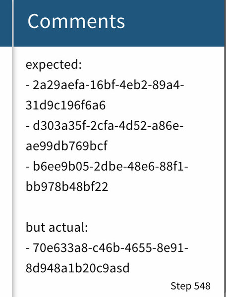

Navigating
=================================

.. index::
   single: step

Your program execution consists of series of steps. Each step is
equivalent to a single line of code being executed and recorded
by the debugger. You can navigate to any step using the timeline
slider. It is not very practical for large sessions, for which
there are navigation features explained later on this page.

High-level view
~~~~~~~~~~~~~~~~~~~~~~~~~~~~~~~~~

.. index::
   single: timeline
   single: timeline; slider

When browsing a debugging session you always want to know your whereabouts. 
In order to quickly assess how far into the program execution you are, you 
can look at the timeline slider. For the exact position, check your 
current step at the top-right corner of the slider.

   Timeline slider

.. index::
   single: frames

When browsing larger sessions it is valuable to know your whereabouts
precisely. Frames panel helps you with that, and it is identical to a
similar view which can be found in a traditional debugger.

At the top of the list, you will usually find your current position (class, 
method and line). It is marked with a light blue highlight. You can click 
on any item in the Frames panel to access locations up the stack. Your 
current step will change, and so will the highlight in the Frames panel.

   Frames panel

Stepping through code
~~~~~~~~~~~~~~~~~~~~~~~~~~~~~~~~~

.. index::
   single: steppping; over
   single: steppping; back
   single: steppping; into
   single: steppping; out

Traditional stepping is the most basic way of navigating through the code 
execution. You can do this with the following keyboard shortcuts:

* :kbd:`k` - Step over to the next line
* :kbd:`i` - Step back to the previous line
* :kbd:`l` - Step into the method
* :kbd:`j` - Step out of the method

.. note::

  "Step out" works slightly differently than the traditional debugger. It
  goes up the stack trace, and stays there, rather than moving over to the next entry.
  This was done intentionally to get more natural UX even for the sake of consistency
  with what you might be used to.

Method calls
~~~~~~~~~~~~~~~~~~~~~~~~~~~~~~~~~

With a large session, it's easier to use "points of interest" to explore them.
Method calls serve a very good purpose for that. You can search for any method
using a regex, by typing it into "Find method calls" search box.

Example search queries:

* Transaction.begin
* login
* User.*.<init>

   Type a regexp to find method calls

After the successful search you can use a method timeline to navigate for all occurrences.

* Click "left arrow" to find a previous occurrence
* Click "right arrow" to find the next occurrence

   Navigate method calls

Virtual breakpoints
~~~~~~~~~~~~~~~~~~~~~~~~~~~~~~~~~

Use virtual breakpoints when you're looking for all calls to a specific location
in the method. Virtual breakpoints are similar to breakpoints in a traditional debugger. But instead
stopping program execution, they show you all occurrences when the selected line is
executed. In order to register a virtual breakpoint click on the line gutter of the editor.

   Virtual breakpoint in line 37 of class LocationTest

Object modifications
~~~~~~~~~~~~~~~~~~~~~~~~~~~~~~~~~

It's very common that you will be interested in how specific variable
or object change. After :doc:`registering a watch <inspection>` you can
navigate all modifications to an object structure by using modification timeline. 

   Navigate object modifications

.. note::

  Modification timeline is different (better) than a "field watchpoint" in the 
  traditional debugger. It will show you every change to the object structure.

There are multiple types of watches, and each of them represents a different concept:

By name
^^^^^^^

Register by double-clicking on a variable, parameter or field in the code editor

Use it to navigate all modifications of a variable, field 
or parameter with a specific name. It might show you modifications for many 
different instances.

By reference
^^^^^^^^^^^^

Register by clicking "Pin this reference" in the "Watches" section

Use to navigate modifications of a single instance. 
It will show you modifications of the instance regardless of the name of 
a variable, parameter or field holding it. You can recognize it by a "#" 
and a reference number which follows a variable name.

Halik will automatically register this watch if a variable name points
to the only single instance in a whole session.

You can register it manually too. Click on the "Pin this reference" in the "Watches"
section to transform your "by name" watch into "by reference" watch

   "Pin a reference" to transform "by name" watch into "by reference" watch

By expression
^^^^^^^^^^^^^

Register by typing **$<expression>** in the "Find occurrences" search box

Use it to navigate modifications of a variable where it is set to a specific 
value, eg. when the balance is set to 10, or when the name is set to 
"Reginald".

In order to register this watch use "Find occurrences" search 
box, and type **$<expression>**, eg. **$i<=5**.

You can also use it for strings and enum types, eg. **$stringVar == 'closed'**
or **$enumVar == 'ACTIVE'**.

Comments
~~~~~~~~~~~~~~~~~~~~~~~~~~~~~~~~~

.. index::
   single: comments

Timelines may not be flexible enough to give you the right "points of interest".
Let's take this example - you are debugging an issue and want to mark all "suspicious"
state changes. You can easily do that with comments.

Select a block of code in the editor, and a comment with your custom description will
get attached to a current step.

   Add comment

You can see all comments you added to the session by opening the "Comments" tab.

   "Comments" tab

