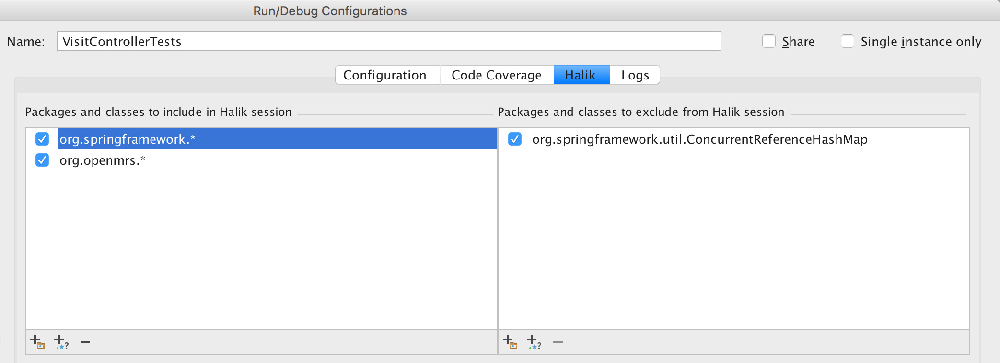

Recording
=================================

.. index::
   single: recording

Recording occurs after you run your program using Halik runner from IntelliJ.
During recording all executed lines of code, and state changes will be captured.

.. note::
  
  Currently supported languages:
   * Java
   * Kotlin (experimental)
   * Clojure (experimental)

Recording process can be quite resource-intensive. In some cases, it may slow down
your program execution by an order of magnitude.

.. note::

  By default Halik only records your project source code. It tries to exclude
  all code coming from imported libraries.
  
  This behavior is in the experimental phase. It may sometimes
  not be applied correctly. This will cause:
  
    * nothing being recorded,
    * or cause your program run more than 10 times slower.
  
  If you notice any of the above please follow instructions below
  to configure Halik manually.

.. _manually-configure-recording:

Manually configure the scope of recording
~~~~~~~~~~~~~~~~~~~~~~~~~~~~~~~~~~~~~~~~

.. index::
   single: recording; advanced

There are a few cases when you will want to use manual configuration:

* nothing has been recorded after you run your program with Halik
* you want the recording to include more information, such as what happened
  in external libraries (Spring, Hibernate, etc.)
* you are running a Clojure program (see :ref:`clojure-support`).

Please follow these steps to configure the scope of recording manually:

#. Navigate to "Run configuration".
#. Go to Halik tab.
#. Add appropriate filters:

  * include packages and classes that contain code which you want to debug,
  * use "exclude packages and classes" to apply exceptions to be ignored
    on top of the included packages and filters.

See an example below:

* including **org.openmrs.*** which contain project code.
* including **org.springframework** which is Spring Framework.
* but excluding **org.springframework.util.ConcurrentReferenceHashMap** to avoid performance impact.

Record collection and maps state
~~~~~~~~~~~~~~~~~~~~~~~~~~~~~~~~~~~

.. index::
   single: recording; collections

Observing how your collections change is extremely valuable for the debugging process.
At them same time it is non-trivial with a time traveling debugger. Halik currently 
comes with an experimental version of support for capturing collection and maps. 
It will record only a subset 
You can enable it by selecting a checkbox in "Run configuration"

Java support
~~~~~~~~~~~~~~~~~~~~~~~~~~~~

Follow the :ref:`quick-start` instructions.

Kotlin support
~~~~~~~~~~~~~~~~~~~~~~~~~~~~

Follow the :ref:`quick-start` instructions.

.. _clojure-support:

Clojure support
~~~~~~~~~~~~~~~~~~~~~~~~~~~~

Follow instructions below to record Clojure programs. You can find more information
on the "clojure.main" namespace used below in `Clojure documentation <http://clojure.org/reference/repl_and_main>`__.

Record a script
^^^^^^^^^^^^^^^^^^

#. Navigate to **Edit configurations**.
#. Add new configuration for **Application**.
#. Configure:

  * set **Main class** to "clojure.main"
  * set **Program arguments** to "-i <path_to_script>"
  * set Halik filters (see :ref:`manually-configure-recording`)

Record an application with "main"
^^^^^^^^^^^^^^^^^^^^^^^^^^^^^^^^^^^^

#. Navigate to **Edit configurations**.
#. Add new configuration for **Application**.
#. Configure:

  * set **Main class** to "clojure.main"
  * set **Program arguments** to "-m <your_package>"
  * set Halik filters (see :ref:`manually-configure-recording`)

